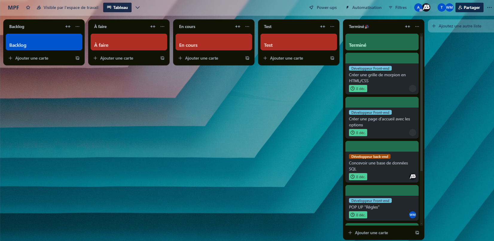

# README - Projet MPF (Morpion Foot)

## **Description du projet**

**MPF (Morpion Foot)** est un site web reprenant les règles classiques du jeu du morpion, mais en remplaçant les croix et les ronds par des joueurs de football. Les joueurs doivent avoir des connexions (critères communs) en fonction de leur nationalité, des clubs dans lesquels ils ont joué, ou des trophées remportés.

### **Public cible**

- Fans de football.
- Joueurs amateurs de jeux stratégiques simples et rapides.

### **Objectifs principaux**

- Proposer une expérience ludique mettant à l’épreuve les connaissances footballistiques des joueurs.
- Créer un jeu accessible en ligne avec une interface intuitive.

---

## **Méthode de travail**

Le projet a été développé selon la **méthode Scrum**, organisé en deux sprints :

### **1. Rôle du chef de projet**

En tant que chef de projet, chaque jour, j’organisais des réunions rapides avec les membres de l'équipe pour :

1. Faire le point sur l’avancement des tâches.
2. Identifier les priorités du jour.
3. Détecter et résoudre les problèmes ou blocages rencontrés.

---

## **Organisation des sprints**

### **Sprint 1 : Mise en place, maquette, partie front, conception de la base de données**

**Objectif :**
Mettre en place l’infrastructure du projet, concevoir les maquettes et développer la structure front-end de base.
Créer la base de données pour gérer les informations nécessaires au jeu (joueurs, critères, parties).

#### **Répartition des tâches**

- **Aathavan Thevakumar (Chef de projet et Développeur Full-Stack) :**
  - Supervision générale et validation des livrables.
  - Finalisation des critères fonctionnels et non-fonctionnels.
  - Développement de la grille interactive en JavaScript.

- **Abeeschan Krishnakumar (Développeur Back-End) :**
  - Conception et création de la base de données (SQL).
  - Remplissage initial de la base avec des données fictives.

- **Warrick Mansoibou (Designer UI/UX) :**
  - Création des maquettes sur Figma.
  - Conception des interfaces des pages principales : accueil, grille, règles, à propos.

- **Nicolas Rannou (Développeur Front-End) :**
  - Développement des pages statiques (HTML/CSS).
  - Intégration des maquettes validées.

- **Trystan Kecket-Baker (Testeur/Support) :**
  - Tests des pages statiques (navigation, responsive design).
  - Assistance pour enrichir les données de la base.

#### **Définir les User Stories (US) :**

| ID  | User Story                                                                                                  |
| --- | ----------------------------------------------------------------------------------------------------------- |
| US1 | En tant qu’utilisateur, je veux accéder à une page d’accueil pour commencer une partie de morpion foot.     |
| US2 | En tant qu’utilisateur, je veux voir une grille de morpion interactive prête à recevoir des joueurs.        |
| US3 | En tant que développeur, je veux concevoir une base de données pour stocker les joueurs et leurs critères.  |
| US4 | En tant qu’utilisateur, je veux accéder à une page expliquant les règles du jeu.                            |
| US5 | En tant que développeur, je veux m’assurer que les maquettes sont validées avant le début du développement. |
| US6 | En tant que développeur, je veux commencer à rendre la grille interactive en JavaScript.                    |

#### **Backlog :**

| User Story | Tâche                                                                          | Priorité | Critère d’acceptation                                                | Conception           | État    |
| ---------- | ------------------------------------------------------------------------------ | -------- | -------------------------------------------------------------------- | -------------------- | ------- |
| US1        | Créer une page d’accueil avec les options "Jouer", "Règles", "À propos".  | 1        | La page d’accueil est accessible et fonctionnelle                    | Maquette + Front-end | Terminé |
| US2        | Créer une grille de morpion interactive en HTML/CSS.                           | 1        | La grille est visible, bien alignée, et prête pour les interactions  | Front-end            | Terminé |
| US3        | Concevoir une base de données pour gérer les joueurs et leurs critères.        | 1        | Une base de données avec les tables nécessaires est définie et prête | SQL + Back-end       | Terminé |
| US4        | Concevoir une page "Règles" expliquant les bases du jeu et son fonctionnement. | 2        | La page affiche les règles de manière claire et concise              | Maquette + Front-end | Terminé |
| US5        | Créer des maquettes validées pour l’ensemble des pages principales.            | 1        | Les maquettes respectent les exigences UI/UX et sont approuvées      | Figma                | Terminé |
| US6        | Ajouter des interactions simples sur la grille (changement de couleur, clic).  | 1        | La grille réagit aux clics et affiche une animation de base.         | JavaScript           | Terminé |



---

### **Sprint 2 : Communication entre le back et le front, tester**

**Objectif :**
Relier le back-end au front-end pour assurer la fonctionnalité du jeu.
Tester l’intégration pour valider le bon fonctionnement des différentes interactions.

#### **Répartition des tâches**

- **Aathavan Thevakumar (Chef de projet et Développeur Full-Stack) :**
  - Supervision de l’intégration front-back.
  - Mise à jour de la grille pour afficher dynamiquement les données.

- **Abeeschan Krishnakumar et Trystan Kecket-Baker (Développeurs Back-End) :**
  - Création des endpoints pour la communication avec le front-end.
  - Implémentation des requêtes SQL pour récupérer et valider les données.

- **Nicolas Rannou et Warrick Mansoibou (Développeurs Front-End) :**
  - Connexion des actions utilisateur (boutons) aux endpoints.
  - Mise à jour de l’affichage dynamique de la grille et de la barre de recherche.

- **Trystan Kecket-Baker (Testeur/Support) :**
  - Tests des interactions entre le front-end et le back-end.
  - Vérification des connexions et des fonctionnalités dynamiques.

#### **Définir les User Stories (US) :**

| ID  | User Story                                                                                                     |
| --- | -------------------------------------------------------------------------------------------------------------- |
| US1 | En tant qu’utilisateur, je veux voir mes actions (sélections, coups joués) être enregistrées en temps réel.    |
| US2 | En tant que développeur, je veux valider les connexions entre joueurs (exemple : même nationalité, même club). |
| US3 | En tant que développeur, je veux relier la grille interactive aux données enregistrées en base de données.     |
| US4 | En tant que testeur, je veux vérifier que chaque partie se joue correctement sans erreurs.                     |

#### **Backlog :**

| User Story | Tâche                                                                                            | Priorité | Critère d’acceptation                                                                       | Conception         | État     |
| ---------- | ------------------------------------------------------------------------------------------------ | -------- | ------------------------------------------------------------------------------------------- | ------------------ | -------- |
| US1        | Relier le front-end au back-end pour enregistrer et récupérer les données de la base de données. | 1        | Les joueurs placés sur la grille sont sauvegardés en base de données.                       | PHP/MySQL          | En cours |
| US2        | Implémenter la logique pour vérifier les connexions (même nationalité, club, etc.).              | 1        | Les connexions valides sont mises en évidence, et les erreurs signalées.                    | Back-end (PHP)     | En cours |
| US3        | Mettre à jour la grille de jeu en fonction des données récupérées de la base de données.         | 1        | Les modifications faites dans la base de données sont visibles en temps réel sur la grille. | JS/PHP             | En cours |
| US4        | Tester les interactions pour détecter les bugs potentiels.                                       | 2        | Aucun bug majeur ne doit empêcher le déroulement d’une partie complète.                     | Tests fonctionnels | À faire  |

---

## **Structure du projet**

### **Langages et technologies utilisés**

- **Front-end :** HTML, CSS, JavaScript (Bootstrap pour le design).
- **Back-end :** PHP (pour la logique serveur).
- **Base de données :** MySQL (hébergée sur Alwaysdata).

### **Organisation des fichiers**

```
/
|-- index.html          # Page d'accueil
|-- jeu.html            # Page principale du jeu
|-- css/                # Styles CSS
|-- js/                 # Scripts JavaScript
|-- img/                # Images et icônes
|-- PHP/                # Scripts SQL pour la base de données
|-- BD/                 # La base de données
```

---

## **Hébergement**

Le projet est hébergé sur **Vercel**.

- URL d'accès au site : [https://mpf-self.vercel.app/].

---

## **Conclusion et perspectives**

- Le Sprint 1 a été une réussite, avec des bases solides pour le projet.
- Le Sprint 2 a permis d’avancer sur des fonctionnalités critiques, mais reste inachevé.

**Améliorations à prévoir :**

1. Finaliser la communication front/back.
2. Optimiser la validation des critères.
3. Améliorer les tests pour garantir